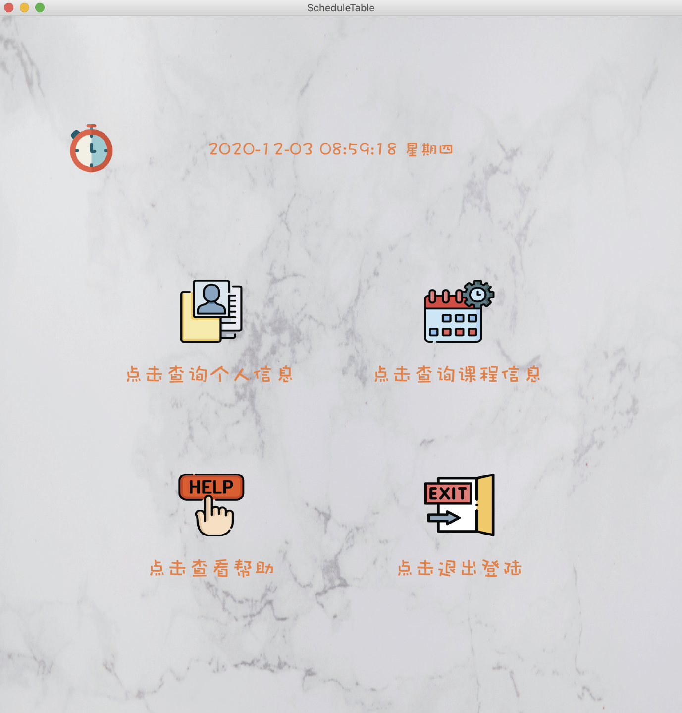
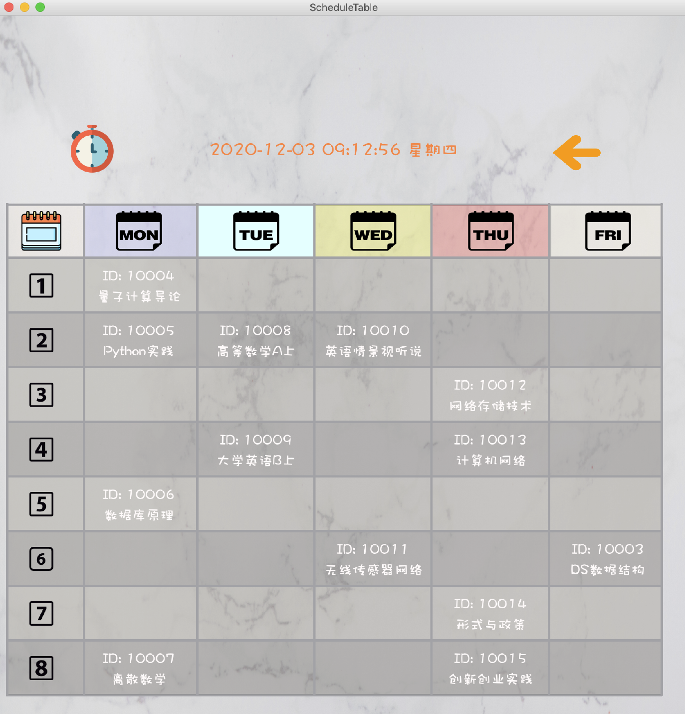

# Educational-Administration-System
## 📕BUPT Course: Program Design Practice
A simple educational administration system

---
## 👀Notice
This project is developed by Qt Creator.

For more details please refer to 

---

## 🖼Runtime Screenshot
- Login Interface

- Main Interface

- Schedule Table Interface

---

## ✉Contact Us

Feel free to open an issue if you have any questions about our project.
